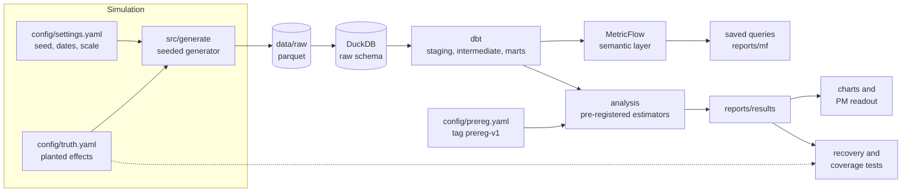

# Payments Experimentation Lab: should checkout drop the CVC field?

A pre-registered A/B test of removing the card security code (CVC) field from a merchant's checkout, run end to end on **simulated, Stripe-shaped data** (200,000 customers, 1.5M checkout sessions, 8 weeks). The pipeline goes from a seeded data generator through a dbt + DuckDB warehouse and a MetricFlow semantic layer to a customer-clustered analysis whose metrics, margins, and decision rules were frozen in git before any treatment and control comparison was run. Because the data is synthetic and the effects were planted, the project also checks its own work: the analysis recovers the planted effects, and a 200-world simulation measures how often its confidence intervals are right.

**Recommendation (what the pre-registered rules conclude): ship to segment.** Remove the CVC field for low-risk customers, keep it for high-risk customers, and run a confirmatory test for medium-risk customers. Shipping to low risk is worth about **$1.59M a year** [$1.06M, $2.12M] *(exploratory sizing)*. Treating everyone would be worth **$2.26M** [$1.60M, $2.93M], but the rules block it because disputes among high-risk customers rise far past break-even. Another $0.74M a year is pending on the medium-risk test.

| Metric | Control | Treatment | Lift | 95% CI | p | Verdict |
|---|---|---|---|---|---|---|
| Checkout conversion (primary) | 51.05% | 52.62% | +3.1% | [+2.6%, +3.6%] | 6e-34 | Significant lift |
| Checkout conversion, weeks 3-8 | 50.79% | 52.18% | +2.7% | [+2.2%, +3.3%] | 1e-24 | Significant lift |
| Dispute rate (matured) | 0.36% | 0.47% | +30.3% | [+21.0%, +39.7%] | 4e-13 | Pass: bound +0.14pp vs margin +0.21pp |
| Authorization rate | 91.90% | 91.40% | -0.5% | [-0.7%, -0.4%] | 1e-12 | Pass: bound -0.64pp vs margin -1.00pp |
| Revenue per transaction | $68.15 | $68.37 | +0.3% | [-0.1%, +0.7%] | 0.1 | Pass: bound -0.1% vs margin -2.0% |
| Net value per session, weeks 3-8 | | | +$0.230 | [+$0.162, +$0.298] | | CI above $0 |


**Read next:** the one-page PM memo, [reports/experiment_readout.md](reports/experiment_readout.md), and the plan it was judged against, [reports/preregistration.md](reports/preregistration.md).

---

## Methods highlights

**Confidence intervals that are honest, checked by simulation.** Customers were randomized, but conversion is measured per session, and the same customer's sessions are correlated. All estimates use customer-clustered (delta method) standard errors. To test them, `make coverage` rebuilds 200 independent simulated worlds (generator, dbt, and the pre-registered estimators, 50,000 customers each) and counts how often each 95% CI contains the planted truth:

| Quantity | Covered | Coverage | 95% interval |
|---|---|---|---|
| Conversion, all weeks | 184/200 | 92.0% | [87.3%, 95.4%] |
| Conversion, weeks 3-8 | 186/200 | 93.0% | [88.5%, 96.1%] |
| Conversion, week 1 | 193/200 | 96.5% | [92.9%, 98.6%] |
| Authorization change | 184/200 | 92.0% | [87.3%, 95.4%] |
| Revenue per transaction | 188/200 | 94.0% | [89.8%, 96.9%] |
| Dispute rate | 192/200 | 96.0% | [92.3%, 98.3%] |
| **Conversion, naive binomial (ignores clustering)** | **148/200** | **74.0%** | **[67.3%, 79.9%]** |
| Conversion, CUPED | 189/200 | 94.5% | [90.4%, 97.2%] |

Every pre-registered interval passed the criterion fixed before the run (nominal 95% inside the 99% binomial interval). Conversion and authorization sit slightly low at 92%, plausibly small-sample behavior of the delta method at 50,000 customers. The coverage simulation was added after the full-scale dispute CI missed its planted value (+30% [21%, 40%] vs +40%), and shows that miss was chance; it is logged as post-hoc validation in [reports/deviations.md](reports/deviations.md).

**Naive vs clustered.** Treating sessions as independent gives a conversion CI of [+2.8%, +3.4%] instead of [+2.6%, +3.6%]: 37% too narrow (the clustered standard error is 1.59x the naive one). In simulation the naive interval covers the truth only 74% of the time.

**Early reads understate risk.** Disputes arrive up to 60 days after a charge. On the last day of the experiment only 34% of the eventual dispute increase was visible (+0.037pp vs +0.109pp matured). Adjusting for arrival lag with a curve fit on pre-period charges recovered the level but still understated the relative increase (+22% vs +30%), as pre-registered: removing CVC adds fraud disputes (63% of treatment disputes vs 50% in control), and fraud arrives later than the pre-period mix the curve was fit on. The decision waited for matured data.

**Re-randomization before launch.** The first assignment salt failed a pre-period A/A check: conversion already differed by 4.2 customer-clustered standard errors before any treatment. Three checks ruled out a bug (300 placebo salts gave z-scores with SD 1.00; pre-period outcomes were bit-identical with everyone forced into control; hidden-trait balance had SD 1 across 200 seeds). A rule fixed before looking at candidates (first salt with |z| < 2 and all covariates balanced) chose the second salt (z = +0.82). This follows the A/A practice in Kohavi, Tang & Xu, *Trustworthy Online Controlled Experiments*; choosing among assignments this way makes standard CIs slightly conservative, never optimistic.

**CUPED.** Using each customer's pre-period conversion as a covariate cut the variance of the conversion estimate by 21% (+3.0% [+2.5%, +3.4%]). It is framed as variance reduction, not imbalance correction: after re-randomization the pre-period gap was small.

**Economics, not just p-values.** The dispute non-inferiority margin (+0.215pp) is the break-even point at which the margin from the smallest worthwhile conversion lift is eaten by dispute costs (lost charge, $15 fee, $20 ops cost), derived in [reports/preregistration.md](reports/preregistration.md). The decision rules combine statistical tests with net value per session and its CI, per risk band with Holm correction.

## Verify the pre-registration

The analysis plan, [config/prereg.yaml](config/prereg.yaml) (machine-readable; the analysis code reads every parameter from it) and [reports/preregistration.md](reports/preregistration.md), is tagged `prereg-v1`. A disclosure amendment, [reports/prereg_amendments.md](reports/prereg_amendments.md), is tagged `prereg-amendment-1`. Both predate the commit that set `analysis.unblinded: true`, which is the switch that allows treatment vs control comparisons in the experiment window. To check:

```bash
git fetch --tags
scripts/verify_prereg.sh          # or: make verify-prereg
```

or by hand:

```bash
# the commit that flipped the blindness gate
UNBLIND=$(git log --reverse --format=%H -S'unblinded: true' -- config/settings.yaml | head -1)
git log -1 --format='%h %ad %s' --date=iso "$UNBLIND"

# both tags are ancestors of it, and the gate was still closed at each tag
git merge-base --is-ancestor prereg-v1 "$UNBLIND" && echo "prereg-v1 predates unblinding"
git merge-base --is-ancestor prereg-amendment-1 "$UNBLIND" && echo "prereg-amendment-1 predates unblinding"
git show prereg-amendment-1:config/settings.yaml | grep unblinded      # unblinded: false

# the frozen files have not changed since
git diff --stat prereg-v1 HEAD -- config/prereg.yaml reports/preregistration.md
git diff --stat prereg-amendment-1 HEAD -- reports/prereg_amendments.md
```

Tests enforce the same rules on every run: `tests/test_prereg.py` fails if the frozen files change after their tags, if `unblinded` is true without the tags, or if analysis code hardcodes any pre-registered value. Git history proves order, not intent: the author designed the simulation and knew the planted effects, which the pre-registration states plainly, along with every earlier look at the data.

## Architecture



Only the generator and the recovery test read `config/truth.yaml` (one more test reads the hidden risk labels to check randomization); `tests/test_conventions.py` enforces that.

## The semantic layer, for a finance stakeholder

A semantic layer is a single, governed definition of each business metric that every report and analysis queries, so "conversion rate" means the same thing in a dashboard, a notebook, and a board deck. This project uses [MetricFlow](https://docs.getdbt.com/docs/build/about-metricflow) on top of the dbt marts.

If you know Power BI, you already know the idea. The concepts map almost one to one:

| Power BI semantic model | MetricFlow in this project |
|---|---|
| Fact and dimension tables joined by relationships (a star schema) | Semantic models joined by entities: `checkout_sessions` and `charges` facts, `customers` and `experiment_assignments` dimensions, all linked through `customer` |
| A DAX measure such as `DIVIDE([Successful sessions], [Sessions])` | A ratio metric (`checkout_conversion_rate`) |
| `CALCULATE([Disputes], Charges[IsMatured] = TRUE)` | A metric input filter (`dispute_rate` counts only matured charges) |
| A marked date table | The `metricflow_time_spine` model |
| Saved report pages or bookmarks | Saved queries |

The difference is that the definitions live in version-controlled YAML ([dbt/models/semantic/](dbt/models/semantic/)), are reviewed like code, and are validated against the warehouse on every build.

| Metric | Definition | Role in the experiment |
|---|---|---|
| `checkout_conversion_rate` | Successful (captured) sessions / checkout sessions | Primary metric |
| `authorization_rate` | Authorized charges / attempted charges | Guardrail: issuers may decline more without CVC |
| `revenue_per_transaction` | Captured USD volume / successful charges | Guardrail |
| `dispute_rate` | Disputed charges / successful charges, **matured charges only** | Guardrail: fraud risk |
| `total_payment_volume` | Sum of captured amounts in USD | Business context |
| `dispute_rate_observed_at_experiment_end` | Disputes opened before the experiment ended / successful charges | Illustration only: why early reads mislead |

Charges are dated by their checkout session (`metric_time` is session time for every metric), so a payment made a few minutes after midnight lands in the same week as the session that produced it. `customer__is_exposed` is available as a filter; experiment queries use exposed customers only.

```bash
cd dbt
uv run mf query --metrics checkout_conversion_rate,dispute_rate --group-by metric_time__week
uv run mf query --saved-query experiment_scorecard_by_variant
```

`scripts/mf_queries.sh` runs the five standard saved queries (by week, by variant, by country) into `reports/mf/`. Until the plan was pre-registered, the three that compare treatment with control inside the experiment window were gated off and the gate was enforced by a test.

### Reconciliation

Every metric is tied out the way a finance team ties a report to the ledger. `tests/test_reconciliation.py` queries MetricFlow for the experiment window and compares each number with a hand-written SQL query on the marts: counts exactly, payment volume to the cent, ratios to 6 decimals. The hand SQL filters on raw timestamps rather than the dbt `period` column, so the check also covers the window logic.

## How to run

Requires [uv](https://docs.astral.sh/uv/) (it installs Python 3.12 and every dependency into the project).

```bash
make all          # about a minute: generate data, dbt build, validate the semantic layer, run the saved
                  # queries, power analysis, pre-registered analysis, charts, readout, lint, and tests
make coverage     # about 3 minutes, optional: the 200-world CI coverage simulation
make verify-prereg
```

Everything rebuilds from one seed in `config/settings.yaml`. Generated data (`data/`, about 500MB) is gitignored and never committed; the committed `reports/` outputs are byte-stable across reruns on the same platform. CI (GitHub Actions) runs lint, data generation, `dbt build`, semantic layer validation, the analysis, and the test suite on every push, with full history and tags so the pre-registration checks run.

## Project structure

```
config/
  settings.yaml        experiment design, dates, seed, blindness gate
  prereg.yaml          machine-readable pre-registration (tag prereg-v1)
  truth.yaml           planted effects; read only by the generator and the recovery test
src/generate/          seeded generator: customers, sessions, charges, disputes, assignments
dbt/
  models/staging/      typed views over the raw Stripe-shaped objects
  models/intermediate/ session funnel outcomes, charge disputes with maturity flags, exposure
  models/marts/        fct_checkout_sessions, fct_charges, dim_customers, dim_experiment
  models/semantic/     MetricFlow semantic models, metrics, saved queries, time spine
  tests/               custom data tests (one variant per customer, funnel, dispute lag, grain)
analysis/              estimators, decision rules, power, early read, charts, readout
reports/
  experiment_readout.md   PM memo
  preregistration.md      the plan, frozen at prereg-v1
  prereg_amendments.md    pre-unblinding disclosure, frozen at prereg-amendment-1
  deviations.md           everything done beyond the plan
  power_analysis.md       naive vs clustered power
  coverage.md             CI coverage simulation
  results/                machine-readable results and summary table
  figures/                charts
scripts/               mf_queries.sh, verify_prereg.sh
tests/                 data, balance, reconciliation, exposure, conventions, prereg, recovery
```

## Limitations

**The data**
- **Simulated.** One merchant, customers, and effects are generated; the method is the deliverable, not the numbers.
- **The author knew the planted effects**, so the pre-registration demonstrates process discipline, not true blindness. Every earlier look at the data is disclosed, including one at in-window rates by arm under a discarded assignment.
- **Simplified payments:** at most one charge per session (no retries), one card per customer, fixed FX rates, no 3D Secure or network tokens, no seasonality.
- **Dispute lag is capped at 60 days.** Real disputes can arrive later, so the matured dispute rate is a floor.
- **The pre-period has returning customers only**, so baselines used for power and economics exclude new customers.

**The analysis**
- **The risk score was built with knowledge of the generator.** Its features (new account, prepaid card, BR or MX) were chosen by someone who knew how risk was simulated; a real team would derive them from history and Radar. It was validated only on pre-period data.
- **The 70% dispute loss rate is an assumption** (pre-period observed: 61%), set by an author who knew it would likely affect the high-risk verdict; disclosed in an amendment before unblinding. The decision is unchanged at 61% and at all 27 points of the cost sensitivity grid.
- **Slightly narrow intervals:** simulated coverage for conversion and authorization CIs is 92%, inside the pre-set criterion but below nominal.
- **The high-risk band is underpowered** (4.6% of sessions; dispute non-inferiority power 22% to 37% even with no true effect), which is why the rules distinguish inconclusive from harmful. Its verdict rests on a large effect.
- **Account-age balance:** under the dbt definition the chosen assignment has p = 0.012 on account age band (minimum of 5 covariates; about 6% likely by chance). A pre-registered regression adjustment gives the same estimate (+3.1%).
- **Recovery:** six of seven planted effects fall inside their 95% CIs; the overall dispute lift is a documented 2-SE chance miss.
- **Segment results are exploratory.** Shipping to the low-risk band should go through a staged rollout with a holdout; the medium band needs its own confirmatory test.

## What I would do next with real data

- **Use Stripe's own risk signals.** Replace the hand-built score with Radar risk scores and early fraud warnings, which arrive days before disputes and would shorten the read.
- **Model dispute arrival properly.** Survival models by reason code, and inquiries as leading indicators, instead of waiting a fixed 60 days; extend the maturity window where reason codes allow late filing.
- **Go issuer-level on authorization.** The authorization hit varies by card brand here; with real data, look at BIN and issuer country, and test network tokens or 3D Secure as a way to recover declines without CVC.
- **Sequential or always-valid inference** for the guardrails, so a dispute problem can stop the test early without inflating error rates.
- **Heterogeneous effects with honest splitting** (for example causal forests fit on one half, evaluated on the other) instead of rule-based bands, then a pre-registered targeting test.
- **Account for retries and multiple payment methods**, and for cross-merchant effects if CVC removal shifts fraud elsewhere.

## License

[MIT](LICENSE)
