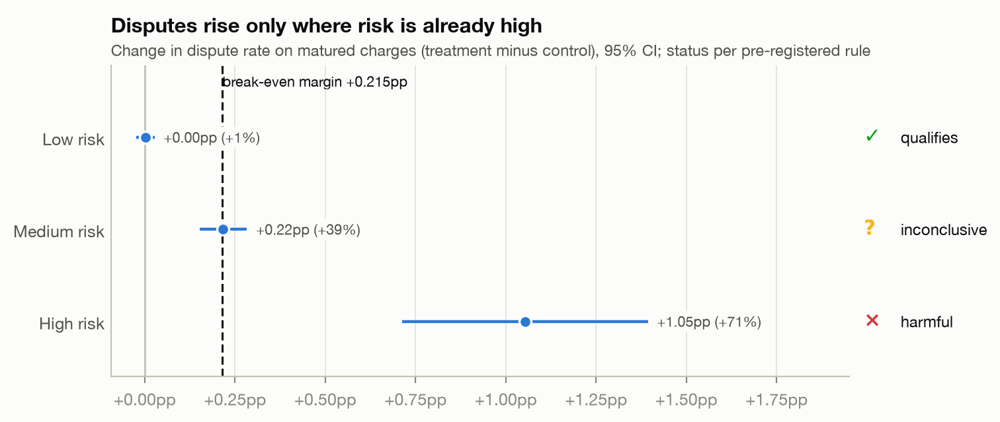
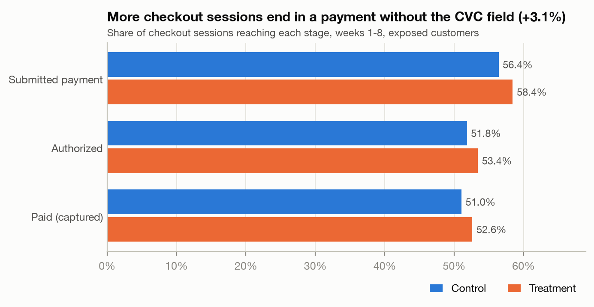
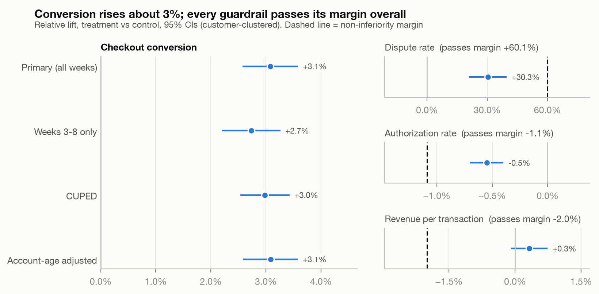
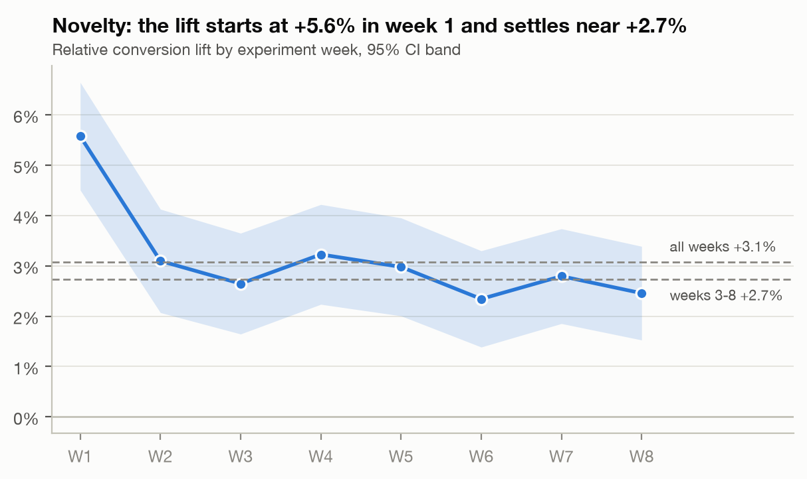
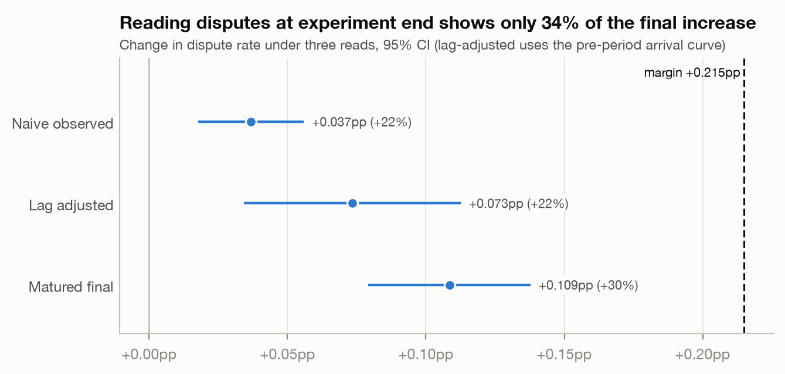
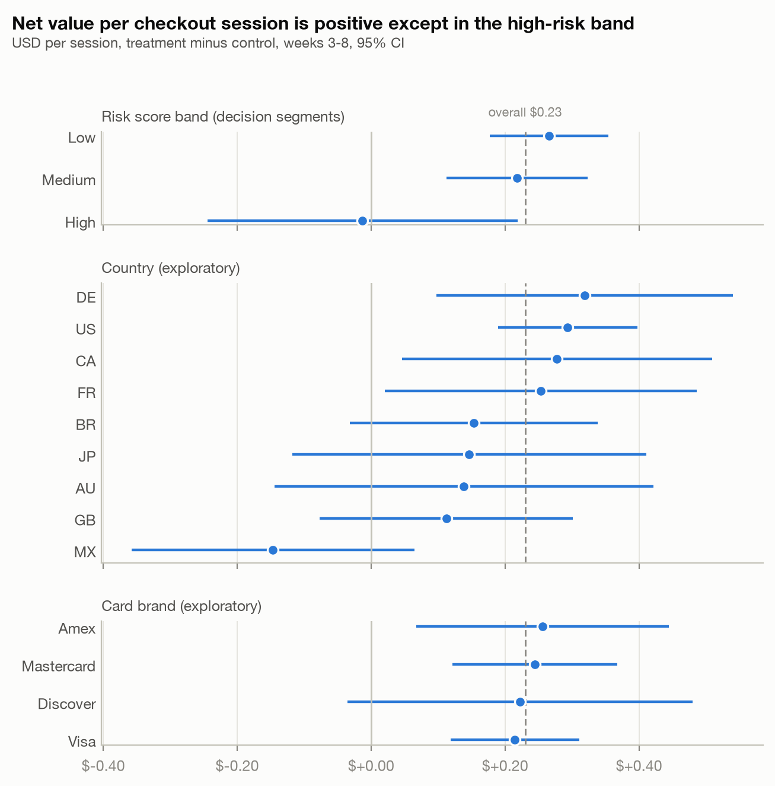

# Removing the CVC field: experiment readout

For: product. Experiment `exp_remove_cvc`, Jun 1 to Jul 27, 2026 (8 weeks, 200,000 customers), disputes matured through Sep 25, 2026. Plan pre-registered at tag `prereg-v1`.

## Recommendation

The pre-registered decision rules conclude **ship to segment**: **remove the CVC field for low-risk customers**; **keep it for high-risk customers**; **run a confirmatory test for medium-risk customers** before deciding. The same decision holds at the observed 61% dispute loss rate and at all 27 points of the cost sensitivity grid.

- **Value of shipping to low risk: $1.59M a year** [$1.06M, $2.12M] *(exploratory)*. Treating every customer would have been worth $2.26M [$1.60M, $2.93M] (pre-registered), but the rules block it because disputes in the high-risk band rise far past break-even.
- **Pending on the medium-risk test: $0.74M a year** [$0.38M, $1.10M] *(exploratory)*.
- High-risk customers add no value: -$0.01 per session, with disputes up 71%.

## What happened

Without the CVC field, **checkout conversion rose +3.1%** [+2.6%, +3.6%] (+1.57pp). Part of that is novelty: week 1 was +5.6%, and weeks 3-8 settle at **+2.7%** [+2.2%, +3.3%], the rate to plan on. Net of extra disputes, treatment earned **$0.23 per checkout session** [+$0.16, +$0.30] in weeks 3-8.

| Metric | Control | Treatment | Lift | 95% CI | p | Verdict |
|---|---|---|---|---|---|---|
| Checkout conversion (primary) | 51.05% | 52.62% | +3.1% | [+2.6%, +3.6%] | 6e-34 | Significant lift |
| Checkout conversion, weeks 3-8 | 50.79% | 52.18% | +2.7% | [+2.2%, +3.3%] | 1e-24 | Significant lift |
| Dispute rate (matured) | 0.36% | 0.47% | +30.3% | [+21.0%, +39.7%] | 4e-13 | Pass: bound +0.14pp vs margin +0.21pp |
| Authorization rate | 91.90% | 91.40% | -0.5% | [-0.7%, -0.4%] | 1e-12 | Pass: bound -0.64pp vs margin -1.00pp |
| Revenue per transaction | $68.15 | $68.37 | +0.3% | [-0.1%, +0.7%] | 0.1 | Pass: bound -0.1% vs margin -2.0% |
| Net value per session, weeks 3-8 | | | +$0.230 | [+$0.162, +$0.298] | | CI above $0 |

## Guardrails

All three pass overall. Authorization fell 0.50pp (some issuers decline more without CVC), inside the 1.0pp limit; that revenue loss is already inside the conversion lift. Revenue per transaction did not move. Disputes rose +0.109pp (+30%), below the +0.215pp break-even margin.

## Segment finding

The overall averages hide where the risk sits. By observable risk band:

| Risk band | Sessions | Conversion lift | Dispute change | Net value per session (95% CI) | Annual value *(expl.)* | Rule status |
|---|---|---|---|---|---|---|
| Low | 61% | +3.2% | +0.00pp (+1%) | +$0.27 [+$0.18, +$0.35] | $1.59M | **qualifies** |
| Medium | 35% | +3.1% | +0.22pp (+39%) | +$0.22 [+$0.11, +$0.32] | $0.74M | **inconclusive** |
| High | 5% | +3.2% | +1.05pp (+71%) | -$0.01 [-$0.24, +$0.22] | -$0.01M | **harmful** |

## Risks

- **Synthetic data.** The merchant, customers, and effects are simulated; the method is the deliverable.
- **Risk score built with generator knowledge.** The band rules (new account, prepaid card, BR or MX) were chosen by someone who knew how risk was simulated. A real team would derive them from history and Radar.
- **Loss-rate assumption.** The model assumes 70% of disputes are lost; the observed rate is 61%. The decision is unchanged at 61% ($2.30M a year overall).
- **Disputes after 60 days are not counted**, so the matured dispute rate is a floor.
- **Low-risk disputes are flat but not zero-risk:** the CI allows up to +0.027pp. Monitor through rollout.

## Next steps

1. Staged rollout of CVC removal to low-risk customers with a holdout, reading disputes at 60 days.
2. **Medium-risk confirmatory test (exploratory design).** 50/50 within the medium band only. Dispute non-inferiority margin **+0.56pp**, the break-even at the observed weeks 3-8 lift (+2.7%) with the band's own revenue per transaction ($65.79) and dispute baseline (0.56%); the frozen +0.215pp was set at the 1% MDE lift. Clustered power 80%, one-sided alpha 0.025: 18,614 sessions per arm for the dispute test and 104,558 for net value above zero (binding: net value). At 9,321 medium-band sessions a day that is 23 days of data after a 14-day novelty burn-in, so run **6 weeks** and read out **102 days after launch** once disputes mature (60 days).
3. Keep CVC for high-risk customers; review with the risk team whether Radar rules can recover their conversion lift safely.

---

## Methods notes

- **Clustering matters.** Customers, not sessions, were randomized. A naive test that treats sessions as independent gives a CI 37% too narrow; in simulation its 95% CI covered the truth only 74% of the time. All estimates use customer-clustered (delta method) standard errors.
- **Early reads understate risk.** At experiment end only 34% of the eventual dispute increase was visible. Adjusting for dispute arrival lag still showed +22% against a matured +30% (28% low), as pre-registered: the extra disputes are fraud (63% of treatment disputes vs 50% in control), which arrives later (exploratory check).
- **Re-randomization.** The first assignment salt failed a pre-period A/A check (z = -4.18); diagnostics ruled out a bug and a rule fixed in advance chose the second salt.
- **CUPED** (pre-period conversion as covariate) cut variance by 21%; estimate +3.0%, consistent with the primary.
- **CI coverage** *(exploratory, added after the dispute miss)*: across 200 simulated worlds the pre-registered 95% CIs covered the planted effects 92% to 96% of the time (dispute rate 96%), so the intervals are honest and the dispute miss was chance. See [coverage.md](coverage.md).
- **Recovery.** Six of seven planted effects fall inside their 95% CIs. The overall dispute lift (planted +40%, estimated +30%) is a documented 2-SE chance miss.
- Deviations and exploratory additions: [deviations.md](deviations.md). Full outputs: [results/](results/). Pre-registration: [preregistration.md](preregistration.md), [prereg_amendments.md](prereg_amendments.md).

### Figures

